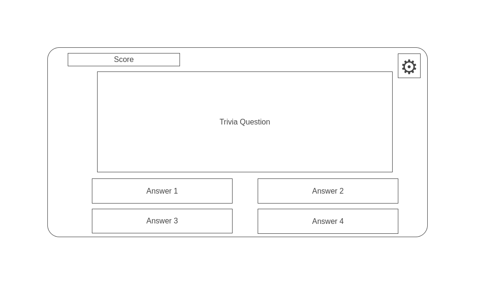
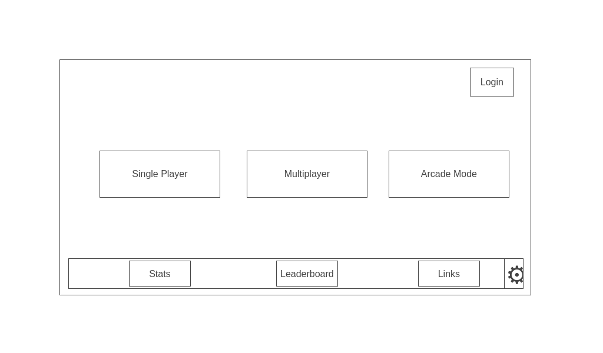

## Background:
The JavaScript Quiz Game is an interactive web application that offers users the opportunity to engage in an educational and entertaining quiz experience. Players can select their preferred categories, set the level of difficulty, and specify the number of questions they want to answer. The game aims to enhance users' knowledge and challenge their understanding of various subjects while providing an enjoyable gaming experience.

## Functionality & MVPs:

In the JavaScript Quiz Game, users will be able to:

Select Categories: Users can choose from a list of predefined quiz categories, such as History, Science, Literature, Sports, etc. These categories will cover a wide range of topics to cater to diverse interests.

Choose Difficulty Level: Players can set the difficulty level of the questions they will face during the quiz. Options might include Easy, Medium, and Hard, each representing varying levels of complexity.

Customize Question Count: Users have the flexibility to specify the number of questions they want to answer in the quiz. The default number of questions will be set to 10, but users can adjust this to their preference.

Answer Questions: The core functionality of the game involves presenting questions to users based on their category and difficulty preferences. Users will select the correct answer from a set of multiple-choice options.

Track Score: As users progress through the quiz, the application will keep track of their score. Each correct answer contributes to their total score, while incorrect answers may have point deductions based on the chosen difficulty level.

Display Results: At the end of the quiz, users will receive a summary of their performance, including the total score, the number of correct and incorrect answers, and an evaluation of their quiz-taking skills.

## Wireframes

**In addition, this project will include:**

Responsive Design: The application will be designed with responsiveness in mind, ensuring an optimal user experience across various devices and screen sizes.

Instructions & README: A comprehensive README file will be included in the project repository. This README will contain detailed instructions on how to set up the project locally, how to play the game, and any additional information needed for users and developers.

Category and Question Management: Players will have the ability to manage quiz categories and questions. This could include adding new categories, creating new questions, and editing existing content.

User Authentication: To provide a personalized experience, users can create accounts or log in to existing ones (optional, users can play as a guest). This allows them to keep track of their quiz history and scores over time. 

Leaderboard: The application will feature a leaderboard that displays the top scores achieved by different players. Users can see how their scores compare to those of other players, fostering a sense of competition and encouraging replayability. The leaderboard will showcase the usernames or avatars of top players, along with their respective scores and quiz performance statistics. This feature adds a social and competitive element to the game, enhancing user engagement and motivation to improve their quiz-taking skills.

By implementing these functionalities, the JavaScript Quiz Game aims to create an engaging and user-friendly experience for players who seek both entertainment and education. The combination of customizable options, varied categories, and a user-friendly interface will make the game appealing to a wide audience.

## Technologies, Libraries, APIs

## Timeline

1. **Day 1: Planning and Setup**
   - Spend time defining the game's flow, user interface, and how questions will be displayed.
   - Set up your development environment, including a code editor and browser for testing.

2. **Day 2: API Integration and Basic UI**
   - Learn how to make API requests using JavaScript's `fetch` or other libraries.
   - Write code to fetch questions from the API based on user-selected categories and difficulty.
   - Create a basic UI layout using HTML and CSS for category selection and displaying questions.

3. **Day 3: Game Logic and Question Display**
   - Implement the game logic to track user selections, handle correct/incorrect answers, and calculate scores.
   - Write JavaScript functions to display questions and options dynamically on the page.
   - Test the basic functionality of fetching questions and displaying them.

4. **Day 4: User Experience and Styling**
   - Focus on improving the user experience, making sure the game is easy to navigate and use.
   - Apply CSS styles to enhance the visual appearance of the game.
   - Test the game thoroughly, including different scenarios and edge cases.

5. **Day 5: Testing, Bug Fixing, and Finalization**
   - Spend time testing the game extensively to identify and fix any bugs or issues.
   - Fine-tune the styling and layout for a polished look.
   - If time allows, consider adding extra features like a timer, hints, or a review of answered questions.
   - Document your code and project.